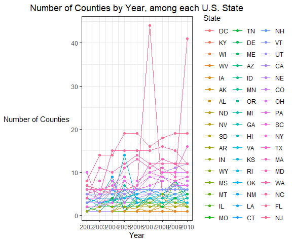
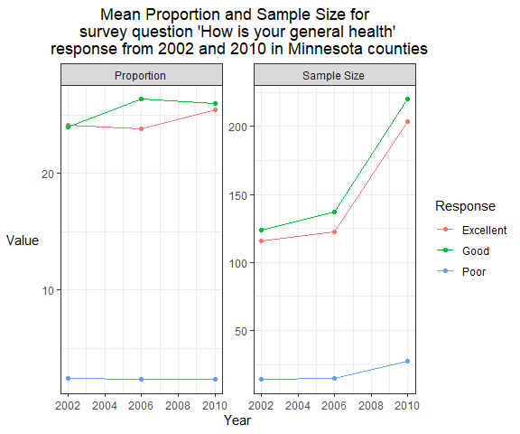

Homework 2 - Eric Connor
================
Eric Connor
2/9/2022

# Problem 1. Github repository (10 points)

The Github repository is named pubh7462\_hw2\_conno400, and is connected
through an RProject. The /data folder is added to the .gitignore file.

# Problem 2. Best Practices and Consistent Style (20 points)

# Problem 3. BRFSS SMART 2002-2010

## 3.1. Data Exploration and Cleaning

Import Dataset

``` r
brfss <- read.csv(file = "brfss_smart_2010.csv")
```

Perform Exploratory Data Analysis through the DataExplorer package.
There is a large amount of missing data and will need to be investigated
while tidying up the data.

Tidying up the BRFSS 2002-2010 dataset.

``` r
brfss_tidy <- brfss %>%
  filter(Topic == "Overall Health") %>%
  mutate(State = Locationabbr,
         County = str_sub(Locationdesc, 5),
         State = factor(State),
         Response = factor(Response),
         County = factor(County)) %>%
  select(Year, State, County, Response, Sample_Size, Data_value)

head(brfss_tidy)
```

    ##   Year State            County  Response Sample_Size Data_value
    ## 1 2010    AL  Jefferson County Excellent          94       18.9
    ## 2 2010    AL  Jefferson County Very good         148       30.0
    ## 3 2010    AL  Jefferson County      Good         208       33.1
    ## 4 2010    AL  Jefferson County      Fair         107       12.5
    ## 5 2010    AL  Jefferson County      Poor          45        5.5
    ## 6 2010    AL     Mobile County Excellent          91       15.6

State, County, and Response option were all converted to categorical
options because they are categorical variables. Although county and
state have a large number of categories, it is still appropriate to
convert to a factor instead of a string. Now, the BRFSS dataset just
contains the variables of interest on the data that we are curious in
investigating.

## 3.2. Data Description

``` r
nrow(brfss_tidy)
```

    ## [1] 10625

``` r
ncol(brfss_tidy)
```

    ## [1] 6

The BRFSS dataset is now 10,625 by 6, with 10,625 cases and 6 variables.
The 6 variables include:

-   Year: The year the study value was collected in a particular state
    and county.
-   State: State of where the data value was collected in a particular
    state, county, and year.
-   County: County of where the data value was collected in a particular
    state, county, and year.
-   Response: Response option in reply to the survey question “How is
    your general health?”
-   Sample\_Size: Sample Size for the amount of responses to the survey
    question among a certain state, county, and year.
-   Data\_value: Prevalence estimate for each response to the survey
    question among a certain state, county, and year.

A case in the dataset is defined as a response option among a particular
state, county, and year.

This dataset will need to be wrangled into proper format when completing
a graph because states and counties are repeated for the amount of years
and response options the survey question “How is your general health?”

## 3.3 Do Data Science

### 3.3.1. In the year 2004, which states were observed at 6 locations?

``` r
brfss_tidy %>%
  filter(Year == 2004) %>%
  arrange(State) %>%
  distinct(State, County) %>%
  group_by(State) %>%
  summarise(num_locations = n()) %>%
  filter(num_locations == 6)
```

    ## # A tibble: 8 x 2
    ##   State num_locations
    ##   <fct>         <int>
    ## 1 CO                6
    ## 2 CT                6
    ## 3 MD                6
    ## 4 NM                6
    ## 5 SC                6
    ## 6 TX                6
    ## 7 UT                6
    ## 8 VT                6

There were 8 states that were observed at 6 locations. These 8 states
include:

1.  Colorado
2.  Connecticut
3.  Maryland
4.  New Mexico
5.  South Carolina
6.  Texas
7.  Utah
8.  Vermont

### 3.3.2. Make a spaghetti plot that shows the number of observed locations in each state from 2002 to 2010. Which state has the highest mean number of locations over this period?

``` r
brfss_tidy %>%
  arrange(State) %>%
  group_by(State, Year) %>%
  distinct(State, County) %>%
  summarise(num_locations = n()) %>%
  #mutate(State = fct_reorder(State, num_locations, mean)) %>%
  ggplot(aes(x = Year, y = num_locations, color = fct_reorder(State, num_locations, mean))) +
  geom_line() +
  geom_point() +
  theme_bw() +
  xlab("Year") +
  ylab("Number of Counties") +
  scale_x_continuous(breaks = seq(2002, 2010, 1)) + 
  scale_color_discrete(name = "State") + 
  ggtitle("Number of Counties by Year, among each U.S. State") +
  theme(plot.title = element_text(hjust = 0.5),
        axis.title.y = element_text(angle = 0, vjust = 0.5))
```



The above displays a spaghetti plot with the number of observed
locations in each of the 50 U.S. states and the District of Columbia.
Overall New Jersey has the highest mean number of locations over this
period. Despite it not having the highest number of any year, it does
have the highest average number of locations for the BRFSS survey from
2002 to 2010.

### 3.3.3. Make a table showing, for the years 2002, 2006, 2010, the mean and standard deviation of sample size and proportion of Excellent, Good, and Poor responses across locations in MN.

``` r
brfss_tidy %>%
  filter(State == "MN" & Year %in% c(2002, 2006, 2010)) %>%
  group_by(Response, Year) %>%
  summarise(mean_ss = mean(Sample_Size),
            sd_ss = sd(Sample_Size),
            mean_prop = mean(Data_value),
            sd_prop = sd(Data_value)) %>%
  filter(Response %in% c("Excellent", "Good", "Poor")) %>%
  gt() %>%
  tab_spanner(label = "Sample Size",
              columns = c("mean_ss", "sd_ss")) %>%
  tab_spanner(label = "Proportion",
              columns = c("mean_prop", "sd_prop")) %>%
  cols_label(mean_ss = "Average",
             sd_ss = "Std. Deviation",
             mean_prop = "Average",
             sd_prop = "Std. Deviation") %>%
  tab_header("Sample Size and Standard Deviations of Excellent, Good, and Poor responses to survey question 'How is your general health?' in Minnesota") %>%
  fmt_number(columns = c("mean_ss", "sd_ss"),
             decimals = 0) %>%
  fmt_number(columns = c("mean_prop"),
             decimals = 2) %>%
  fmt_number(columns = c("sd_prop"),
             decimals = 1)
```

<div id="fyjpfzicym" style="overflow-x:auto;overflow-y:auto;width:auto;height:auto;">
<style>html {
  font-family: -apple-system, BlinkMacSystemFont, 'Segoe UI', Roboto, Oxygen, Ubuntu, Cantarell, 'Helvetica Neue', 'Fira Sans', 'Droid Sans', Arial, sans-serif;
}

#fyjpfzicym .gt_table {
  display: table;
  border-collapse: collapse;
  margin-left: auto;
  margin-right: auto;
  color: #333333;
  font-size: 16px;
  font-weight: normal;
  font-style: normal;
  background-color: #FFFFFF;
  width: auto;
  border-top-style: solid;
  border-top-width: 2px;
  border-top-color: #A8A8A8;
  border-right-style: none;
  border-right-width: 2px;
  border-right-color: #D3D3D3;
  border-bottom-style: solid;
  border-bottom-width: 2px;
  border-bottom-color: #A8A8A8;
  border-left-style: none;
  border-left-width: 2px;
  border-left-color: #D3D3D3;
}

#fyjpfzicym .gt_heading {
  background-color: #FFFFFF;
  text-align: center;
  border-bottom-color: #FFFFFF;
  border-left-style: none;
  border-left-width: 1px;
  border-left-color: #D3D3D3;
  border-right-style: none;
  border-right-width: 1px;
  border-right-color: #D3D3D3;
}

#fyjpfzicym .gt_title {
  color: #333333;
  font-size: 125%;
  font-weight: initial;
  padding-top: 4px;
  padding-bottom: 4px;
  border-bottom-color: #FFFFFF;
  border-bottom-width: 0;
}

#fyjpfzicym .gt_subtitle {
  color: #333333;
  font-size: 85%;
  font-weight: initial;
  padding-top: 0;
  padding-bottom: 6px;
  border-top-color: #FFFFFF;
  border-top-width: 0;
}

#fyjpfzicym .gt_bottom_border {
  border-bottom-style: solid;
  border-bottom-width: 2px;
  border-bottom-color: #D3D3D3;
}

#fyjpfzicym .gt_col_headings {
  border-top-style: solid;
  border-top-width: 2px;
  border-top-color: #D3D3D3;
  border-bottom-style: solid;
  border-bottom-width: 2px;
  border-bottom-color: #D3D3D3;
  border-left-style: none;
  border-left-width: 1px;
  border-left-color: #D3D3D3;
  border-right-style: none;
  border-right-width: 1px;
  border-right-color: #D3D3D3;
}

#fyjpfzicym .gt_col_heading {
  color: #333333;
  background-color: #FFFFFF;
  font-size: 100%;
  font-weight: normal;
  text-transform: inherit;
  border-left-style: none;
  border-left-width: 1px;
  border-left-color: #D3D3D3;
  border-right-style: none;
  border-right-width: 1px;
  border-right-color: #D3D3D3;
  vertical-align: bottom;
  padding-top: 5px;
  padding-bottom: 6px;
  padding-left: 5px;
  padding-right: 5px;
  overflow-x: hidden;
}

#fyjpfzicym .gt_column_spanner_outer {
  color: #333333;
  background-color: #FFFFFF;
  font-size: 100%;
  font-weight: normal;
  text-transform: inherit;
  padding-top: 0;
  padding-bottom: 0;
  padding-left: 4px;
  padding-right: 4px;
}

#fyjpfzicym .gt_column_spanner_outer:first-child {
  padding-left: 0;
}

#fyjpfzicym .gt_column_spanner_outer:last-child {
  padding-right: 0;
}

#fyjpfzicym .gt_column_spanner {
  border-bottom-style: solid;
  border-bottom-width: 2px;
  border-bottom-color: #D3D3D3;
  vertical-align: bottom;
  padding-top: 5px;
  padding-bottom: 5px;
  overflow-x: hidden;
  display: inline-block;
  width: 100%;
}

#fyjpfzicym .gt_group_heading {
  padding: 8px;
  color: #333333;
  background-color: #FFFFFF;
  font-size: 100%;
  font-weight: initial;
  text-transform: inherit;
  border-top-style: solid;
  border-top-width: 2px;
  border-top-color: #D3D3D3;
  border-bottom-style: solid;
  border-bottom-width: 2px;
  border-bottom-color: #D3D3D3;
  border-left-style: none;
  border-left-width: 1px;
  border-left-color: #D3D3D3;
  border-right-style: none;
  border-right-width: 1px;
  border-right-color: #D3D3D3;
  vertical-align: middle;
}

#fyjpfzicym .gt_empty_group_heading {
  padding: 0.5px;
  color: #333333;
  background-color: #FFFFFF;
  font-size: 100%;
  font-weight: initial;
  border-top-style: solid;
  border-top-width: 2px;
  border-top-color: #D3D3D3;
  border-bottom-style: solid;
  border-bottom-width: 2px;
  border-bottom-color: #D3D3D3;
  vertical-align: middle;
}

#fyjpfzicym .gt_from_md > :first-child {
  margin-top: 0;
}

#fyjpfzicym .gt_from_md > :last-child {
  margin-bottom: 0;
}

#fyjpfzicym .gt_row {
  padding-top: 8px;
  padding-bottom: 8px;
  padding-left: 5px;
  padding-right: 5px;
  margin: 10px;
  border-top-style: solid;
  border-top-width: 1px;
  border-top-color: #D3D3D3;
  border-left-style: none;
  border-left-width: 1px;
  border-left-color: #D3D3D3;
  border-right-style: none;
  border-right-width: 1px;
  border-right-color: #D3D3D3;
  vertical-align: middle;
  overflow-x: hidden;
}

#fyjpfzicym .gt_stub {
  color: #333333;
  background-color: #FFFFFF;
  font-size: 100%;
  font-weight: initial;
  text-transform: inherit;
  border-right-style: solid;
  border-right-width: 2px;
  border-right-color: #D3D3D3;
  padding-left: 12px;
}

#fyjpfzicym .gt_summary_row {
  color: #333333;
  background-color: #FFFFFF;
  text-transform: inherit;
  padding-top: 8px;
  padding-bottom: 8px;
  padding-left: 5px;
  padding-right: 5px;
}

#fyjpfzicym .gt_first_summary_row {
  padding-top: 8px;
  padding-bottom: 8px;
  padding-left: 5px;
  padding-right: 5px;
  border-top-style: solid;
  border-top-width: 2px;
  border-top-color: #D3D3D3;
}

#fyjpfzicym .gt_grand_summary_row {
  color: #333333;
  background-color: #FFFFFF;
  text-transform: inherit;
  padding-top: 8px;
  padding-bottom: 8px;
  padding-left: 5px;
  padding-right: 5px;
}

#fyjpfzicym .gt_first_grand_summary_row {
  padding-top: 8px;
  padding-bottom: 8px;
  padding-left: 5px;
  padding-right: 5px;
  border-top-style: double;
  border-top-width: 6px;
  border-top-color: #D3D3D3;
}

#fyjpfzicym .gt_striped {
  background-color: rgba(128, 128, 128, 0.05);
}

#fyjpfzicym .gt_table_body {
  border-top-style: solid;
  border-top-width: 2px;
  border-top-color: #D3D3D3;
  border-bottom-style: solid;
  border-bottom-width: 2px;
  border-bottom-color: #D3D3D3;
}

#fyjpfzicym .gt_footnotes {
  color: #333333;
  background-color: #FFFFFF;
  border-bottom-style: none;
  border-bottom-width: 2px;
  border-bottom-color: #D3D3D3;
  border-left-style: none;
  border-left-width: 2px;
  border-left-color: #D3D3D3;
  border-right-style: none;
  border-right-width: 2px;
  border-right-color: #D3D3D3;
}

#fyjpfzicym .gt_footnote {
  margin: 0px;
  font-size: 90%;
  padding: 4px;
}

#fyjpfzicym .gt_sourcenotes {
  color: #333333;
  background-color: #FFFFFF;
  border-bottom-style: none;
  border-bottom-width: 2px;
  border-bottom-color: #D3D3D3;
  border-left-style: none;
  border-left-width: 2px;
  border-left-color: #D3D3D3;
  border-right-style: none;
  border-right-width: 2px;
  border-right-color: #D3D3D3;
}

#fyjpfzicym .gt_sourcenote {
  font-size: 90%;
  padding: 4px;
}

#fyjpfzicym .gt_left {
  text-align: left;
}

#fyjpfzicym .gt_center {
  text-align: center;
}

#fyjpfzicym .gt_right {
  text-align: right;
  font-variant-numeric: tabular-nums;
}

#fyjpfzicym .gt_font_normal {
  font-weight: normal;
}

#fyjpfzicym .gt_font_bold {
  font-weight: bold;
}

#fyjpfzicym .gt_font_italic {
  font-style: italic;
}

#fyjpfzicym .gt_super {
  font-size: 65%;
}

#fyjpfzicym .gt_footnote_marks {
  font-style: italic;
  font-weight: normal;
  font-size: 65%;
}
</style>
<table class="gt_table">
  <thead class="gt_header">
    <tr>
      <th colspan="5" class="gt_heading gt_title gt_font_normal gt_bottom_border" style>Sample Size and Standard Deviations of Excellent, Good, and Poor responses to survey question 'How is your general health?' in Minnesota</th>
    </tr>
    
  </thead>
  <thead class="gt_col_headings">
    <tr>
      <th class="gt_col_heading gt_columns_bottom_border gt_right" rowspan="2" colspan="1">Year</th>
      <th class="gt_center gt_columns_top_border gt_column_spanner_outer" rowspan="1" colspan="2">
        <span class="gt_column_spanner">Sample Size</span>
      </th>
      <th class="gt_center gt_columns_top_border gt_column_spanner_outer" rowspan="1" colspan="2">
        <span class="gt_column_spanner">Proportion</span>
      </th>
    </tr>
    <tr>
      <th class="gt_col_heading gt_columns_bottom_border gt_right" rowspan="1" colspan="1">Average</th>
      <th class="gt_col_heading gt_columns_bottom_border gt_right" rowspan="1" colspan="1">Std. Deviation</th>
      <th class="gt_col_heading gt_columns_bottom_border gt_right" rowspan="1" colspan="1">Average</th>
      <th class="gt_col_heading gt_columns_bottom_border gt_right" rowspan="1" colspan="1">Std. Deviation</th>
    </tr>
  </thead>
  <tbody class="gt_table_body">
    <tr class="gt_group_heading_row">
      <td colspan="5" class="gt_group_heading">Excellent</td>
    </tr>
    <tr><td class="gt_row gt_right">2002</td>
<td class="gt_row gt_right">116</td>
<td class="gt_row gt_right">83</td>
<td class="gt_row gt_right">24.15</td>
<td class="gt_row gt_right">3.5</td></tr>
    <tr><td class="gt_row gt_right">2006</td>
<td class="gt_row gt_right">122</td>
<td class="gt_row gt_right">73</td>
<td class="gt_row gt_right">23.83</td>
<td class="gt_row gt_right">3.0</td></tr>
    <tr><td class="gt_row gt_right">2010</td>
<td class="gt_row gt_right">204</td>
<td class="gt_row gt_right">191</td>
<td class="gt_row gt_right">25.44</td>
<td class="gt_row gt_right">5.3</td></tr>
    <tr class="gt_group_heading_row">
      <td colspan="5" class="gt_group_heading">Good</td>
    </tr>
    <tr><td class="gt_row gt_right">2002</td>
<td class="gt_row gt_right">124</td>
<td class="gt_row gt_right">84</td>
<td class="gt_row gt_right">23.95</td>
<td class="gt_row gt_right">1.0</td></tr>
    <tr><td class="gt_row gt_right">2006</td>
<td class="gt_row gt_right">137</td>
<td class="gt_row gt_right">86</td>
<td class="gt_row gt_right">26.37</td>
<td class="gt_row gt_right">0.5</td></tr>
    <tr><td class="gt_row gt_right">2010</td>
<td class="gt_row gt_right">220</td>
<td class="gt_row gt_right">196</td>
<td class="gt_row gt_right">26.04</td>
<td class="gt_row gt_right">3.5</td></tr>
    <tr class="gt_group_heading_row">
      <td colspan="5" class="gt_group_heading">Poor</td>
    </tr>
    <tr><td class="gt_row gt_right">2002</td>
<td class="gt_row gt_right">14</td>
<td class="gt_row gt_right">10</td>
<td class="gt_row gt_right">2.40</td>
<td class="gt_row gt_right">1.2</td></tr>
    <tr><td class="gt_row gt_right">2006</td>
<td class="gt_row gt_right">15</td>
<td class="gt_row gt_right">7</td>
<td class="gt_row gt_right">2.30</td>
<td class="gt_row gt_right">1.0</td></tr>
    <tr><td class="gt_row gt_right">2010</td>
<td class="gt_row gt_right">27</td>
<td class="gt_row gt_right">27</td>
<td class="gt_row gt_right">2.36</td>
<td class="gt_row gt_right">0.8</td></tr>
  </tbody>
  
  
</table>
</div>

The above table displays the mean and standard deviations of sample size
and the proportion or prevalence estimate to the survey question “How is
your general health” among the category groups Excellent, Good, and Poor
across the counties in Minnesota. Overall, the sample size has increased
over the years, with 2010 seeing the largest sample size regardless of
response in Minnesota. It also has the largest standard deviation. In
addition, the amount of individuals indicating they have Excellent
health was highest in 2010. Those indicating that they had good health
was the largest in 2006 and the lowest in 2002. Then, the number of
individuals indicating they had poor health was highest in 2002.
Therefore, one could conclude that health tends to get better for
individuals in Minnesota from BRFSS data from the years 2002 to 2010.

### 3.3.4. Create a ggplot that communicates the results/trends from the table above and stands on its own.

``` r
brfss_tidy %>%
  filter(State == "MN" & Year %in% c(2002, 2006, 2010)) %>%
  group_by(Response, Year) %>%
  summarise(mean_ss = mean(Sample_Size),
            sd_ss = sd(Sample_Size),
            mean_prop = mean(Data_value),
            sd_prop = sd(Data_value)) %>%
  filter(Response %in% c("Excellent", "Good", "Poor")) %>%
  pivot_longer(cols = c("mean_ss", "mean_prop"), names_to = "Measure_type", values_to = "Value") %>%
  select(-c("sd_ss", "sd_prop")) %>%
  mutate(Measure_type = fct_recode(Measure_type,
                                   "Sample Size" = "mean_ss",
                                   "Proportion" = "mean_prop")) %>%
  ggplot(aes(x = Year, y = Value, color = Response)) +
  geom_line() +
  geom_point() +
  facet_wrap(~ Measure_type, scales = "free") +
  ggtitle("Mean Proportion and Sample Size for \nsurvey question 'How is your general health'\n response from 2002 and 2010 in Minnesota counties") + 
  theme_bw() +
  theme(plot.title = element_text(hjust = 0.5),
        axis.title.y = element_text(angle = 0, vjust = 0.5))
```



The above plot demonstrates the average proportion and average sample
size for the response groups of Excellent, Good, and Poor to the survey
question “How is your general health?” from Minnesota counties between
the years 2002 and 2010. Overall, you can tell that the sample size
increases among each of the response groups, possibly indicating that
more individuals are completing the BRFSS survey compared to previous
years. In addition, it could just mean that individuals responding to
the survey are just more likely to respond Excellent, Good, or Poor
compared to Very Good or Fair.

Also, there has been a greater proportion of people indicating that they
have Excellent or Good health compared to those with Poor health in
Minnesota counties. Excellent and Good tend to have a large proportion
of responses for the survey question in comparison to other groups. This
is great news for Minnesota counties since most of these respondents,
which are weighted prevalence estimates, tend to have be pleased with
their general health status and have Excellent or Good health. Few
Minnesotans have Poorer health. These results are consistent between
2002 and 2010.
